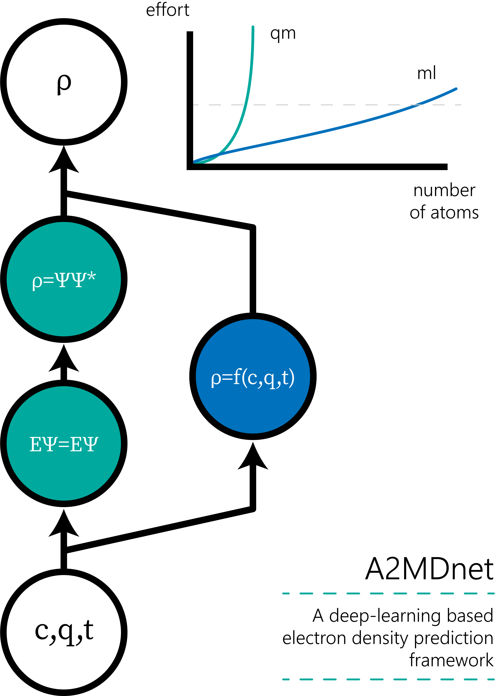

# A2MD

Anisotropic Analitically Modelled Density

## Summary
A2MD is an ensamble of modules that aim to allow to work with electron density, 
model it, and predict it. It is based on the use of atom centered exponential
functions with anisotropic modifications to model bonding density.

The A2MD repository contains:

- **a2mdlib**: read/write chemical formats.
- **a2md**: fit models of electron electron density
- **a2mdnet**: prediction of model parameters using a deep learning approach
- **cdens**: a fast C executable to sample density
- **a2mdtests**: small ensemble of molecules to test the methodology
- **scripts**: the methodology turned into a cli set of tools

Read the docs folder to learn to use the library and the CLI tools. 

## Dependencies

Dependencies can be installed using the requirements.txt file.

    pip3 install -r requirements

The optimum PyTorch version will depend on your hardware, so we recomend system-taylored PyTorch installations.  

## Contact

There is a lot of things to polish, and we'd love feedback. Don't hesitate to contact us:

	bruno.czuviria@upm.es

## Licence

This project is distributed under a GNU GPL v3.0, so the only restriction
is to distribute closed source versions.

